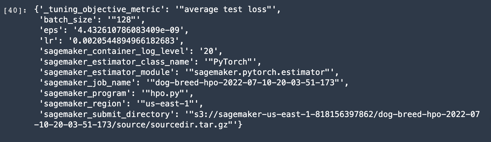
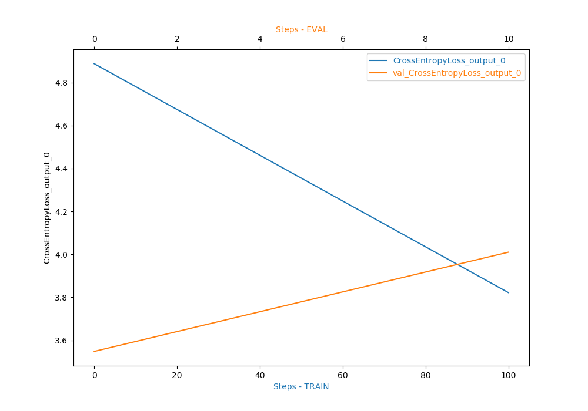
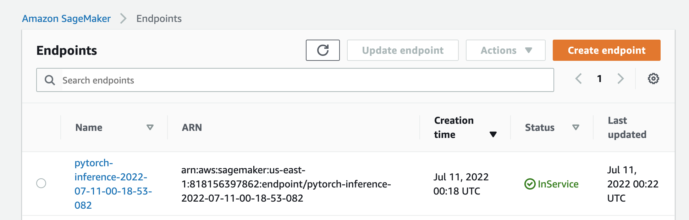

# Image Classification using AWS SageMaker

Use AWS Sagemaker to train a pretrained model that can perform image classification by using the Sagemaker profiling, debugger, hyperparameter tuning and other good ML engineering practices. This can be done on either the provided dog breed classication data set or one of your choice.

## Project Set Up and Installation
Enter AWS through the gateway in the course and open SageMaker Studio. 
Download the starter files.
Download/Make the dataset available. 

## Dataset
The provided dataset is the dogbreed classification dataset which can be found in the classroom.
The project is designed to be dataset independent so if there is a dataset that is more interesting or relevant to your work, you are welcome to use it to complete the project.

### Access
Upload the data to an S3 bucket through the AWS Gateway so that SageMaker has access to the data. 

## Hyperparameter Tuning
What kind of model did you choose for this experiment and why? Give an overview of the types of parameters and their ranges used for the hyperparameter search

I choose the ResNet model as the base model and add several fully connected layers to do the transfer learning. I set 3 hyperparameters for tuning: learning rate: 0.001---0.1 eps: 1e-9---1e-8 batch_size: either 64, 128, or 256

## Debugging and Profiling
I track the accuracy and loss for each epoch of training data and testing data. Also, with those logs information, I could track how the model performs and which step it reaches for each step.

### Results
What are the results/insights did you get by profiling/debugging your model?

We could see even at the last step, the test set accuracy is 24%, which is not pretty high. Profiling/debugging is really helpful to debug and track the model performance, and the smooth lines shown in the debugging plots are as expected.

Remember to provide the profiler html/pdf file in your submission.

I have attached the .html file with my submission git.

## Model Deployment
Give an overview of the deployed model and instructions on how to query the endpoint with a sample input.

Following the steps of the following website, I created the model_fn method in "endpoint.py" to process the input images. https://sagemaker.readthedocs.io/en/stable/frameworks/pytorch/using_pytorch.html#write-an-inference-script .I set the instance to "ml.t2.medium," and then I choose one image from the test sets (the first image of the first type 001) and input it to the deployment pytorch model with correct path.

Remember to provide a screenshot of the deployed active endpoint in Sagemaker.

## Standout Suggestions

